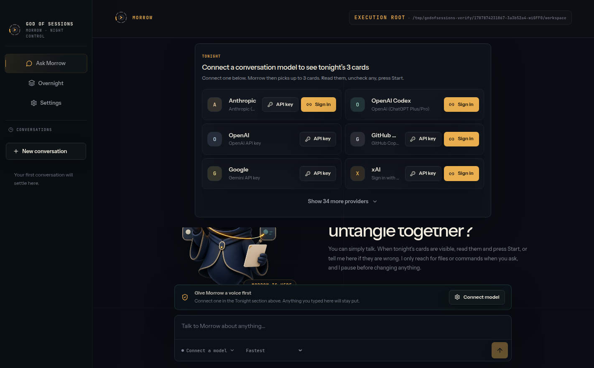

# God of Sessions

A local-first Electron home for conversations with Morrow and provider-neutral Overnight work. MIT licensed.



God of Sessions runs on your machine. Morrow is the chat. Overnight is tonight's work. Settings is where you connect models and CLIs. There is no project picker and no cloud control plane.

The current tree is a pre-release alpha. macOS is the primary development target.

## Features

- **Ask Morrow** — a conversation-first assistant on the model you connect through the Pi Agent SDK. It uses files and commands only when you ask for work that needs them.
- **Tonight cards** — up to three Overnight cards on chat, all checked. Start runs only the cards you leave checked.
- **Overnight** — one Kanban per card, recovered after restart with the provider's own receipt.
- **Overnight workers** — Claude Code, Codex, and Grok Build when their official CLI is on PATH. Pi Agent is listed and not Ready. These workers run only after Start.
- **GitHub identity** — first-run Device Flow with no repository, source-code, organization, or email access.
- **Approvals** — writes and shell commands pause for a readable card before they run.

## Run from source

Requires [Node.js](https://nodejs.org/) 22.19 or newer.

```sh
git clone https://github.com/tumblecat44/godofsessions.git
cd godofsessions
npm install
npm run dev
```

The first window asks you to continue with GitHub. That identity is separate from model-provider login. Connect a conversation model in Settings, then talk on Ask Morrow.

Overnight needs an official CLI on PATH. Claude Code, Codex, and Grok Build show as Ready when that command is on PATH. Pi Agent stays Blocked. PATH presence is not a security claim.

Packaged macOS output (unsigned smoke build):

```sh
npm run package:mac
```

The unpacked app is written to `dist/mac-arm64/God of Sessions.app`. Release signing is a separate step.

## Trust boundary

Electron's main process embeds the Pi Agent SDK. The renderer has no Node access. Morrow conversations are Pi `SessionManager` records on disk.

Read, grep, find, and list run automatically. In-root writes ask first and may be remembered for the active conversation. Shell commands ask every time except exact argument-free `pwd` or `git status`. Overnight planning is read-only until one expiring Start approval freezes the visible cards.

More detail: [OPEN_SOURCE_BOUNDARY.md](OPEN_SOURCE_BOUNDARY.md) and [ADR 0050](docs/adr/0050-electron-pi-morrow-v2.md).

## Development

```sh
npm run check
```

`npm run check` builds the app, runs the unit tests, and tests the landing page. UI and Electron runtime changes also need a real-window drive. See [CONTRIBUTING.md](CONTRIBUTING.md).

## Contributing

Contributions are welcome. The project is maintainer-led and has no guaranteed response time. Open an issue before a large feature. Pull requests must stay inside the public boundary: no credentials, personal transcripts, or live dogfood records.

## License

[MIT](LICENSE). Third-party notices are in [THIRD_PARTY_NOTICES.md](THIRD_PARTY_NOTICES.md).
